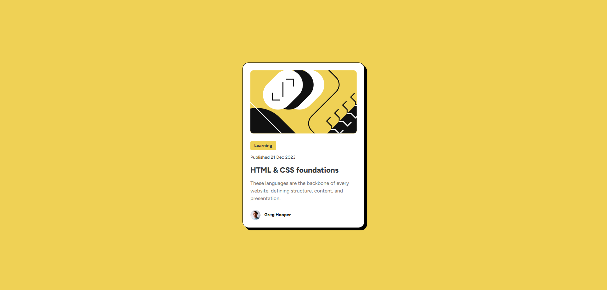
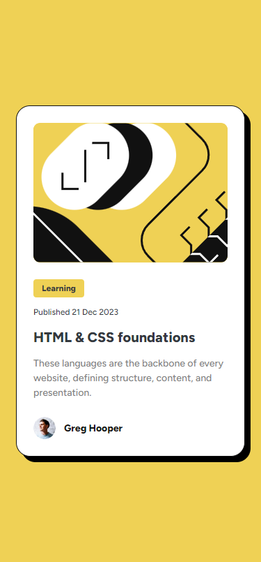
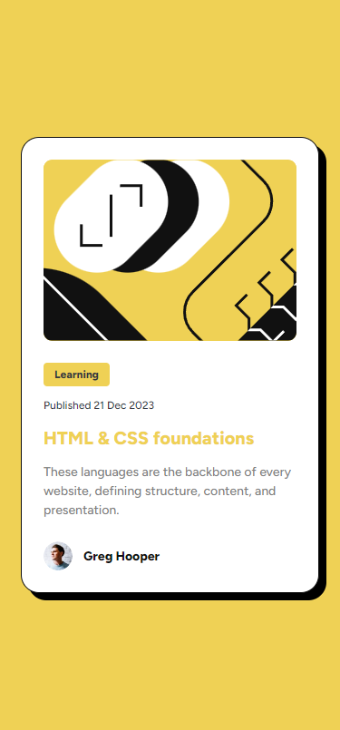

# Frontend Mentor - Blog preview card solution

This is a solution to the [Blog preview card challenge on Frontend Mentor](https://www.frontendmentor.io/challenges/blog-preview-card-ckPaj01IcS). Frontend Mentor challenges help you improve your coding skills by building realistic projects.

## Table of contents

- [Frontend Mentor - Blog preview card solution](#frontend-mentor---blog-preview-card-solution)
  - [Table of contents](#table-of-contents)
  - [Overview](#overview)
    - [The challenge](#the-challenge)
    - [Screenshot](#screenshot)
    - [Links](#links)
  - [My process](#my-process)
    - [Built with](#built-with)
    - [What I learned](#what-i-learned)
  - [Author](#author)

## Overview

### The challenge

Users should be able to:

- See hover and focus states for all interactive elements on the page

### Screenshot

### Links

- Solution URL: [https://github.com/kiattipong-frontend-mentor/blog-preview-card-vite-react-ts](https://github.com/kiattipong-frontend-mentor/blog-preview-card-vite-react-ts)
- Live Site URL: [https://blog-preview-card-vite-react-ts.vercel.app/](https://blog-preview-card-vite-react-ts.vercel.app/)

## My process

### Built with

- Semantic HTML5 markup
- CSS custom properties
- Flexbox
- Desktop-first workflow
- [Vite](https://vitejs.dev/) - Frontend tooling
- [React + TypeScript](https://reactjs.org/) - Frontend framework
- [Joy UI](https://mui.com/joy-ui/getting-started/) - React component library

### What I learned

- create project using Vite + React + TypeScript + Prettier + ESLint + VSCode settings
- Joy UI component library
  - setup default font-family
  - setup primary color palette
- how to display svg image in `` tag
- using media query

## Author

- Website - [My github](https://github.com/choieunsoh)
- Frontend Mentor - [@choieunsoh](https://www.frontendmentor.io/profile/choieunsoh)
- LinkedIn - [@kiattipong-kamonrat](https://www.linkedin.com/in/kiattipong-kamonrat/)
